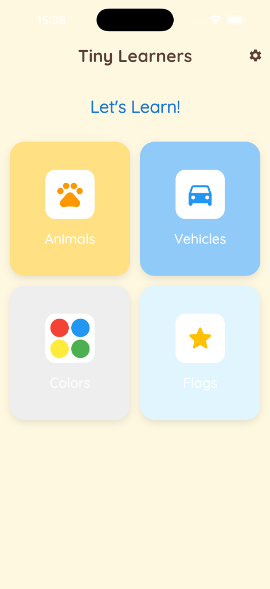
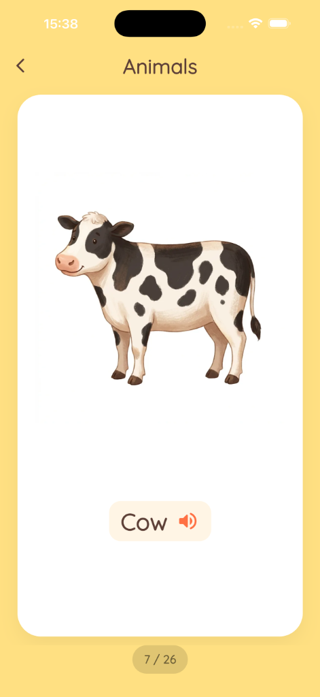
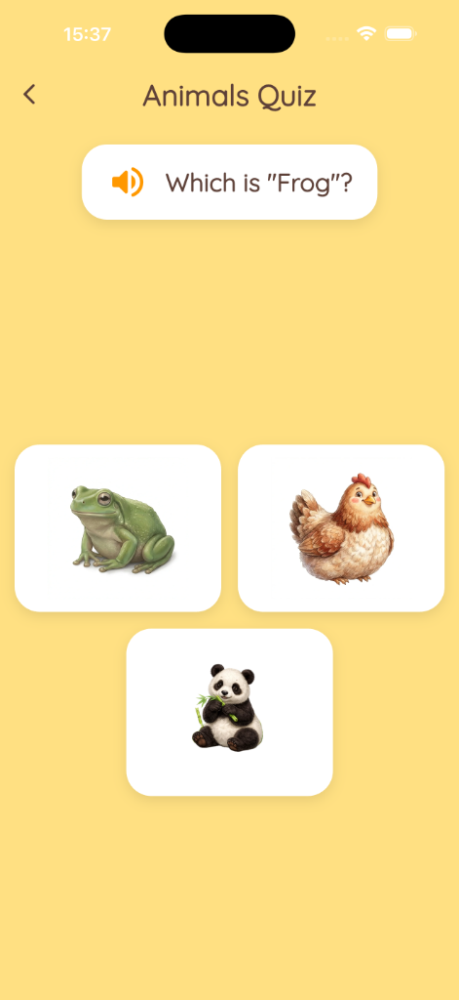

# Tiny Learners 🚀

**Tiny Learners** is an interactive and engaging educational application designed specially for children. It offers a variety of fun and educational game modes to help kids learn while playing.

## ✨ Features

The app includes several exciting game modes and features:

*   **📚 Flashcards**: Interactive cards for learning new words and concepts.
*   **❓ Quiz**: Fun quizzes to test knowledge and reinforce learning.
*   **🧩 Puzzle**: Engaging puzzles to develop problem-solving skills.
*   **🧠 Memory Game**: Classic memory matching games to boost cognitive skills.
*   **🔗 Matching**: Match items to their corresponding pairs.
*   **🥚 Surprise Egg**: A fun reward mode for completed tasks.
*   **🌍 Multi-language Support**: Fully localized content (English, Turkish, etc.) using `easy_localization`.
*   **📶 Offline Support**: Works perfectly without an internet connection, handled by `connectivity_plus`.
*   **📱 Kid-Friendly UI**: Designed with a portrait-locked, colorful, and intuitive interface for little hands.

## 📸 Screenshots

| Home Screen | Flashcards | Quiz Mode |
|:-----------:|:----------:|:---------:|
|  |  |  |

## 🛠️ Tech Stack

This project is built using **Flutter** and leverages several powerful packages:

*   **State Management**: `provider`
*   **Routing**: `go_router`
*   **Local Storage**: `hive`, `shared_preferences`
*   **Localization**: `easy_localization`
*   **Connectivity**: `connectivity_plus`
*   **Networking**: `dio`
*   **Audio**: `audioplayers`, `flutter_tts`
*   **Animations**: `flutter_animate`, `confetti`, `rive`, `lottie`
*   **Fonts**: `google_fonts`

## 📂 Project Structure

```text
lib/
├── models/         # Data models
├── providers/      # State management providers
├── router/         # Application routing configuration
├── screens/        # UI Screens (Home, Modes, Settings, etc.)
├── theme/          # App theme and styling
├── utils/          # Helper utilities (Cache, constants, etc.)
├── widgets/        # Reusable UI components
└── main.dart       # Entry point
```

## 🚀 Getting Started

Follow these steps to run the project locally.

### Prerequisites

*   [Flutter SDK](https://docs.flutter.dev/get-started/install) installed on your machine.
*   An IDE (VS Code or Android Studio) with Flutter extensions.

### Installation

1.  **Clone the repository:**

    ```bash
    git clone https://github.com/your-username/tinny_learn.git
    cd tinny_learn
    ```

2.  **Install dependencies:**

    ```bash
    flutter pub get
    ```

3.  **Run code generation (if needed for Hive/Assets):**

    ```bash
    flutter pub run build_runner build --delete-conflicting-outputs
    ```

4.  **Run the app:**

    ```bash
    flutter run
    ```

---

*Happy Learning!* 🎓
